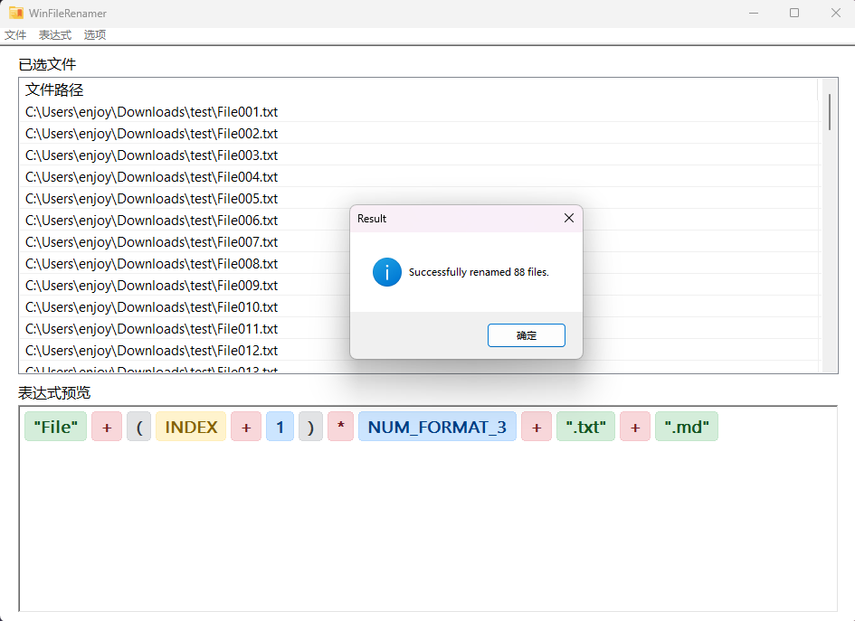

# WinFileRenamer

### 20260416
### README.md

[English](#english) | [中文](#中文)

---

## 🇬🇧 English

  

### Introduction
**WinFileRenamer** is a lightweight, efficient, and flexible batch file renaming tool for Windows, built with C++ and the native Windows API. It allows you to rename multiple files simultaneously using custom expressions, or simply automatically match and rename subtitle files to match their corresponding video files.

### Features
- **Expression-Based Renaming**: Build complex renaming rules using strings, formatting numbers, indices, and original file names, combined with mathematical operators.
- **Auto Subtitle Match**: Automatically detects video files (`.mp4`, `.mkv`, etc.) and subtitle files (`.srt`, `.ass`, etc.) in the selected list, and renames the subtitle files to match the video files exactly.
- **Multi-language UI**: Supports English, Simplified Chinese, Traditional Chinese, Japanese, and Russian.
- **Multithreaded Processing**: Ensures the UI remains responsive while processing large numbers of files.
- **Preview & Saftey**: Shows an expression preview before applying changes.

### How to Use
1. **Open Files**: Click `File` -> `Open` to add the files you want to rename.
2. **Build Expression**: Use the `Expression` menu to add variables, strings, and numbers, or manually type in the Input box and click the corresponding "Push" button.
   - *Push String*: Appends a fixed string.
   - *Push Number*: Appends a fixed number.
   - *Push Minimum Num Length*: Formats a number to a specific length (e.g., length 3 over number 5 -> `005`).
   - *Push Index*: Inserts the auto-incrementing file index.
   - *Push OriginFileName*: Inserts the original file name (without modifying it).
   - Use operators (`+`, `-`, `*`, `/`) and brackets `(`, `)` to combine them.
3. **Submit Rename**: Click `File` -> `Submit Rename` to apply the changes.

### Expression Rules & Example
The expression evaluator uses strict types (Number, String, Format) to determine the outcome of an operation. Here are the core rules:

- **Addition (`+`)**:
  - `Number + Number = Number` (e.g., `5 + 3 = 8`)
  - `String + String = String` (Concatenates strings)
  - `Number + String = String` (Concatenates automatically, e.g., `5 + ".mp4" = "5.mp4"`)
- **Subtraction (`-`) & Division (`/`)**:
  - `Number - Number = Number`
  - `Number / Number = Number`
- **Multiplication (`*`) & Number Formatting**:
  - `Number * Number = Number`
  - **`Number * Format = String` (Crucial)**: You **must** use the multiplication operator (`*`) to combine a Number with a "Minimum Num Length" (Format). This evaluates to a zero-padded string. For example, `5 * Format(3)` yields the string `"005"`.
- **Variables**:
  - `Push Index` is evaluated as a **Number**.
  - `Push OriginFileName` is evaluated as a **String**.

**Practical Example:**
Suppose you want to rename a batch of video files to `MyVideo_001.mp4`, `MyVideo_002.mp4`, etc. You would construct the following expression:
`"MyVideo_" + ( INDEX + 1 ) * NUM_FORMAT_3 + ".mp4"`
*How it evaluates step-by-step:*
1. `INDEX` (e.g., `1`) is a Number. It is multiplied by `NUM_FORMAT_3`.
2. `1 * NUM_FORMAT_3` -> results in the String `"001"`.
3. `"MyVideo_" + "001" + ".mp4"` -> results in the final String `"MyVideo_001.mp4"`.

#### Auto Match Subtitles
If you have a folder with multiple videos and subtitles with mismatched names, load all of them into the list and select `File` -> `Auto Match Subtitles`. **Note: You must load an equal number of video files and subtitle files.** The program will sort the videos and subtitles alphabetically and rename the subtitles to map 1:1 with the video files.

### Build
- Requires Visual Studio with C++ Desktop Development workload.
- Requires C++20 or later.
- Open the `.sln` file and build it using Visual Studio.

---

## 🇨🇳 中文

  

### 简介
**WinFileRenamer** 是一款轻量、高效且灵活的 Windows 批量文件重命名工具。使用 C++ 和原生 Windows API 构建。它允许您通过自定义“计算表达式”来批量重命名多个文件，或者使用一键自动匹配字幕文件的功能。

### 主要功能
- **基于表达式的重命名**：使用字符串、格式化数字、文件序号、原始文件名称以及数学运算符等构建复杂的重命名规则。
- **自动匹配字幕**：自动识别并筛选所选列表中的视频文件（`.mp4`、`.mkv` 等）和字幕文件（`.srt`、`.ass` 等），并自动将字幕文件重命名为对应的视频文件名。
- **多语言界面**：支持英语、简体中文、繁体中文、日语和俄语。
- **多线程处理**：重命名在后台线程运算，保证处理大量文件时界面不会卡顿。
- **预览与安全**：在应用更改之前，可实时预览您构建的表达式。

### 使用方法
1. **打开文件**：点击 `文件` -> `打开` 选择并添加你想重命名的文件。
2. **构建表达式**：通过 `表达式` 菜单添加变量、字符串或数字。如果你想要添加自定义的字符或数字，请先在下方输入框填写内容，然后再点击菜单中的“添加...[输入框]”：
   - *添加字符串*：拼接固定文本。
   - *添加数字*：拼接固定数字。
   - *添加最小数字格式*：格式化数字长度（比如长度为3，应用于数字5，结果为 `005`）。
   - *添加序号*：插入自增的文件索引号。
   - *添加原始文件名*：插入文件的原名。
   - 利用加减乘除运算符 (`+`, `-`, `*`, `/`) 和括号 `(`, `)` 组合这些元素。
3. **应用重命名**：点击 `文件` -> `应用重命名` 即可生效。

### 表达式运算规则与范例
计算引擎会根据数据类型（数字、字符串、数字格式）来决定运算的结果。以下是核心运算规则：

- **加法 (`+`)**：
  - `数字 + 数字 = 数字`（例如 `5 + 3 = 8`）
  - `字符串 + 字符串 = 字符串`（文本拼接）
  - `数字 + 字符串 = 字符串`（自动转换为文本拼接，例如 `5 + ".mp4" = "5.mp4"`）
- **减法 (`-`) 与 除法 (`/`)**：
  - 只能用于 `数字 - 数字` 或 `数字 / 数字`，结果均为数字。
- **乘法 (`*`) 与 数字格式化**：
  - `数字 * 数字 = 数字`
  - **`数字 * 数字格式 = 字符串`（关键）**：要限制数字的最小长度并自动补零，**必须**使用乘号（`*`）将“数字”与“最小数字格式”连接。运算结果会变成一个字符串。例如，`5 * 最小数字格式(3)` 的结果是字符串 `"005"`。
- **变量**：
  - `添加序号 (Index)` 的类型被视为 **数字**。
  - `添加原始文件名 (OriginFileName)` 的类型被视为 **字符串**。

**实战范例：**
假设你要将一批文件重命名为 `MyVideo_001.mp4`, `MyVideo_002.mp4`，你需要构建如下表达式：
`"MyVideo_" + ( INDEX + 1 ) * NUM_FORMAT_3 + ".mp4"`
*运算过程解析：*
1. `INDEX`（例如第 `1` 个文件，作为数字）通过乘号绑定 `NUM_FORMAT_3`（长度为3的数字格式）。
2. `1 * NUM_FORMAT_3` -> 计算得到补零后的字符串 `"001"`。
3. `"MyVideo_" + "001" + ".mp4"` -> 通过加号拼接，得到最终字符串 `"MyVideo_001.mp4"`。

#### 自动匹配字幕名
如果你有一个包含多个视频和对应字幕的文件夹，且字幕名字与视频不匹配。只需将视频和字幕一并导入列表，然后点击 `文件` -> `自动匹配字幕名`。**注意：列表中视频文件和字幕文件的数量必须严格相等。** 程序会按字母顺序自动将字幕重新排序并重命名，使其与视频文件一一对应。

### 编译与构建
- 需要安装带有“使用 C++ 的桌面开发”工作负载的 Visual Studio。
- 需要 C++20 或更高版本标准。
- 打开 `.sln` 文件，用 Visual Studio 进行编译。