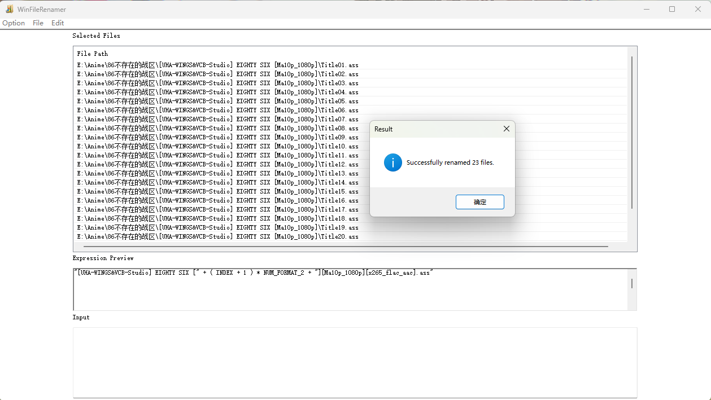

# WinFileRenamer

一个基于 **表达式/公式** 的批量重命名工具，通过 Win32 原生界面实现，可对一次选中的多个文件按统一规则重命名。

` ⚠️ README由AI生成，可能存在部分内容不准确。 `

---

## 0. 图片预览

- 批量对齐番剧字幕，便于播放器自动挂载    

 <br>

## 1. 软件介绍

- **平台**：Windows（Win32 API + 公共控件）
- **界面结构**：
  - 顶部：`Selected Files` 文件列表，显示当前选中的完整路径。
  - 中间：`Expression Preview` 表达式预览区，只读，用来检查当前构造的重命名表达式。
  - 底部：`Input` 输入框，用于临时输入字符串/数字，然后通过菜单“Push”到表达式里。
- **核心思路**：  
  内部实现了一套简单的“表达式引擎”，把 **字符串、整数、变量（索引、原文件名）、括号、运算符** 等都封装成统一的 `Element`，通过生成逆波兰式（RPN）并计算，得到新的目标路径字符串。
- **批量执行**：  
  对列表中的每一个文件，以其在列表中的顺序索引及原文件名作为变量，计算同一个表达式，生成一组新的路径，然后调用 `std::filesystem::rename` 批量重命名。
- **安全措施**：
  - 目标文件已存在 → 直接中止重命名，并提示错误。
  - 原文件不存在 → 中止并提示错误。
  - 表达式非法（括号不匹配、运算符缺失、类型不匹配等） → 中止并弹出错误信息。

---

## 2. 使用方法

### 2.1 启动程序

直接运行 `WinFileRenamer.exe`（入口函数为 `WinMain`，内部会注册窗口类并创建主窗体 `WinFileRenamer`）。

### 2.2 选择文件

菜单栏：**File → Open**

- 使用标准“打开文件”对话框，支持一次选择单个或多个文件。
- 选中的文件会追加到顶部 `Selected Files` 列表中，并缓存其完整路径。

清空列表：**File → Clear**

- 清除列表中所有条目，同时清空内部的文件路径缓存。

> ⚠️ 注意：程序内部是按当前列表的顺序给文件分配索引（或称“序号”），从 **0** 开始：0, 1, 2, 3, …

### 2.3 构造表达式

表达式不会直接从 `Input` 文本框解析，而是通过 **Edit 菜单** 一步步“Push”元素构造：

推荐流程：

1. 在 `Input` 中输入文字或数字  
2. 在菜单 **Edit** 中选择相应的 `Push XXX`  
3. 表达式预览区会更新当前完整表达式  

**常用 Edit 菜单项：**

- `Push Wstring`  
  - 功能：把 `Input` 中的内容作为 **字符串常量** 插入表达式。  
  - 预览中会显示为 `"文本内容"`。

- `Push Number`  
  - 功能：把 `Input` 内容解析为 64 位整数 `Int64` 插入表达式。  
  - 如果不是合法整数，会弹出提示。

- `Push Index`  
  - 功能：插入变量 **INDEX**，代表当前文件在列表中的索引（0,1,2,…）。

- `Push OriginFileName`  
  - 功能：插入变量 **OFNAME**，代表 **原始文件名（包含扩展名，但不包含路径）**。

- `Push MinimunNumLength`  
  - 功能：把 `Input` 解析为整数 `n`，插入一个 **格式化描述符** `NUM_FORMAT_n`（内部类 `Int64_Format`）。  
  - 后续配合作为 `NUM_FORMAT_n * 数字` 使用，用来生成左侧补零的字符串。

- `Push (` / `Push )`  
  - 功能：插入左/右括号，控制运算优先级。

- `Push + / Push - / Push * / Push /`  
  - 功能：插入对应的四则运算符。

- `Delete`  
  - 删除表达式中最后一个元素。

- `Clear`  
  - 清空整个表达式。

表达式构造过程中，预览区会用统一格式展示，例如：

```text
"img_" + NUM_FORMAT_4 * INDEX + ".jpg"
````

```text
"text_" + ( 2 * INDEX + 1 ) + ".txt"
````

其中：

* 字符串用双引号包裹
* 变量是单词（INDEX / OFNAME）
* 数字格式为 `NUM_FORMAT_n`

### 2.4 执行重命名

当表达式构造完成并确认预览无误后：

* 菜单栏点击：**File → Submit Rename**

程序会启动后台线程，步骤大致如下：

1. 将当前表达式转换为逆波兰式（RPN）。
2. 针对列表中的每个文件：

   * 使用当前索引替换变量 `INDEX`
   * 使用当前文件名（不含路径）替换变量 `OFNAME`
3. 计算表达式，得到一个 **新的目标路径字符串**。
4. 调用 `std::filesystem::rename(oldPath, newPath)` 重命名文件。

如果任何一步出错（表达式错误、文件不存在、目标已存在、权限不足等），都会中止并弹出错误；如果全部成功，会弹窗提示成功处理的文件数量。

> ⚠️ 重要说明：
> 表达式计算结果就是 **完整的目标路径字符串**。
>
> * 如果想在原目录下重命名，需要在表达式中显式写出目录字符串（例如 `"D:\Data\"`）。
> * 如果只生成文件名而不带目录，重命名是相对于进程当前工作目录的，这通常不是原来的目录，使用时请谨慎。

---

## 3. 表达式填写和运算规则

### 3.1 数据类型一览

内部主要有以下几类元素：

* **字符串 `Str`**

  * 由 `Push Wstring` 产生，也可由某些运算得到。
* **整数 `Int64`**

  * 由 `Push Number` 产生，使用 64 位带符号整数。
* **格式描述 `Int64_Format`**

  * 在预览中表现为 `NUM_FORMAT_n`。
  * `n` 表示数字的最小长度，用于和整数通过 `*` 运算生成补零字符串。
* **变量 `Var`**

  * `INDEX`：列表索引（0,1,2,…）。
  * `OFNAME`：原始文件名（含扩展名，不含路径）。
* **括号**

  * `(`、`)`，控制运算顺序。
* **运算符 `Int64Opt` 系列**

  * `+`、`-`、`*`、`/`。

### 3.2 运算符语义与优先级

表达式会转换为 RPN 计算，优先级规则与普通数学表达式类似：

* 优先级：`*`、`/` 高于 `+`、`-`
* 括号中的表达式优先计算

具体语义：

1. **加法 `+`**

   * 两侧都是整数 → 整数加法。
   * 任一侧是字符串 → 字符串拼接。
     （整数会先转为字符串再拼接）
   * 常见用法：`"IMG_" + (NUM_FORMAT_4 * INDEX)`，`"prefix_" + OFNAME` 等。

2. **减法 `-`**

   * 仅支持整数减法。
   * 常用于把索引转换为 1 基：`INDEX + 1`，或 `INDEX - 1` 等。

3. **乘法 `*`**

   * 整数 × 整数 → 普通乘法。
   * 整数 × 格式描述 或 格式描述 × 整数：
     生成 **左侧补零的字符串**，长度不少于 `NUM_FORMAT_n` 指定的最小长度。

     * 如 `NUM_FORMAT_4 * 5` → `"0005"`
     * 对于 `INDEX = 12`，`NUM_FORMAT_3 * INDEX` → `"012"`

4. **除法 `/`**

   * 仅支持整数除法，结果向 0 取整。
   * 除数为 0 会返回一个极大的整数（`0x7fffffffffffffff`），属于异常情况，请自行避免。

### 3.3 变量替换

在对某个文件计算表达式前，会做变量替换：

* 遍历 RPN：

  * 遇到 `INDEX`：替换成当前文件索引对应的 `Int64` 值（0,1,2,…）。
  * 遇到 `OFNAME`：将当前文件完整路径构造成 `std::filesystem::path`，取 `filename()`，替换为 `Str` 类型。

### 3.4 结果与错误

* RPN 计算完成后，栈中必须只剩一个元素：

  * 若为整数 → 会转成字符串作为目标路径。
  * 若为字符串 → 直接作为目标路径。
* 常见错误：

  * 括号不匹配
  * 操作数数量或运算符数量不对（缺操作数/缺运算符）
  * 对不支持的数据类型应用算术运算
  * 未替换完的变量类型异常

出错时会抛出异常，由后台线程捕获，并在界面上以消息框形式展示错误信息。

---

## 4. 使用示例

> 以下示例假设要操作的文件都在 `D:\Data\` 目录下。
> 实际使用时请替换成自己的真实目录，并确保目标目录已存在。

### 示例1：按序号原地重命名为 `img_0000.jpg` 形式

需求：
将选中的文件原地重命名为：

```text
img_0000.jpg
img_0001.jpg
img_0002.jpg
...
```

表达式写法：

```text
"img_" + NUM_FORMAT_4 * INDEX + ".jpg"
```

在界面中的操作顺序：

1. `Input` 输入 `img_` → **Push Wstring**
2. 使用 **Push +** 拼接
3. `Input` 输入 `4` → **Push MinimunNumLength**（预览出现 `NUM_FORMAT_4`）
4. 使用 **Push \*** 连接
5. **Edit → Push Index**（插入 `INDEX`）
6. 使用 **Push +** 拼接
7. `Input` 输入 `.jpg` → **Push Wstring**

### 示例 2：索引从 1 开始编号

需求：

```text
file_0001.txt, file_0002.txt, ...
```

表达式：

```text
"D:\Data\" + "file_" + (NUM_FORMAT_4 * (INDEX + 1)) + ".txt"
```

操作要点：

1. 先构造 `(INDEX + 1)`：

   * `Push Index`
   * `Input`：`1` → `Push Number`
   * `Push +`
2. 再配合 `NUM_FORMAT_4` 和 `*` 做补零：

   * `Input`：`4` → `Push MinimunNumLength` → 得到 `NUM_FORMAT_4`
   * `Push *` 组合成 `NUM_FORMAT_4 (INDEX + 1) *`
3. 最后加上 `"D:\Data\"`、`"file_"`、`".txt"` 并用 `+` 串起来。

### 示例 3：按组移动到不同子目录（需事先建好目录）

需求：
假设已经在 `D:\Data\` 下预先创建了：

```text
Group_00\
Group_01\
Group_02\
...
```

希望每 10 个文件为一组，放到对应子目录中：

```text
第 0–9 个文件   → D:\Data\Group_00\原文件名
第 10–19 个文件 → D:\Data\Group_01\原文件名
...
```

表达式：

```text
"D:\Data\Group_" + (NUM_FORMAT_2 * (INDEX / 10)) + "\" + OFNAME
```

含义说明：

* `INDEX / 10`：整数除法，每 10 个文件得到相同的组号。
* `NUM_FORMAT_2 * (INDEX / 10)`：生成两位数字（补零），如 `"00"`、`"01"`、`"02"`。
* 最终拼成 `D:\Data\Group_00\filename.ext` 这样的路径。

> ⚠️ 注意：程序不会自动创建目录，
> 使用该表达式前必须手动创建好例如 `Group_00`、`Group_01` 的子目录，否则重命名会失败。  

---

## 5. 已知限制

当前版本存在以下限制与特性，请在使用时注意：

1. **仅支持 Windows 平台**

   * 使用 Win32 API 和公共控件实现界面，不适用于 Linux / macOS。

2. **不支持“撤销/回滚”**

   * 一旦重命名成功，程序本身无法自动恢复原名。
   * 建议在大量重命名前，先用少量样本、简单表达式做试验；必要时自行备份。

3. **表达式功能有限**

   * 只支持：字符串常量、整数、`INDEX`、`OFNAME`、`NUM_FORMAT_n`、`+ - * /`、括号。
   * **不支持** 条件判断、正则表达式、子串截取/替换等操作。

4. **不会自动创建目录**

   * 若表达式生成了一个指向不存在目录的路径，重命名会失败。
   * 需要提前手动创建好所有可能用到的目标目录。

5. **目标文件已经存在时报错**

   * 当生成的新文件名已存在（同一路径）时，该文件的重命名会被中止，并且整个批处理也可能提前终止。
   * 请务必确保目标命名规则不会与现有文件冲突，或手动处理冲突文件。

6. **路径/文件名必须是合法的 Windows 路径**

   * 表达式生成的字符串中若含有 `<>:"/\\|?*` 等非法字符或保留名，`std::filesystem::rename` 会失败并抛出错误。
   * 程序不会自动清理或过滤这些非法字符。

7. **一次只能有一个重命名任务在执行**

   * 内部通过状态标志控制并发，如果当前重命名线程未结束，再次点击 `Submit Rename` 会提示“Process is already ongoing!”。

在上述限制范围内，WinFileRenamer 仍然能够覆盖 **大部分常规的前缀/后缀添加、按序号命名、简单分组移动** 等批量重命名需求。

